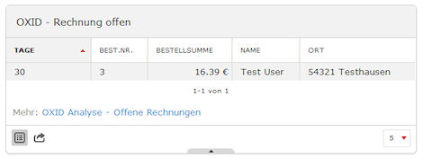

# DEUTSCH #

## 1. Installation ##
 
Entpacken Sie die Zip-Datei in ein beliebiges Verzeichnis so, dass alle Verzeichnisstrukturen erhalten bleiben.
	
Wechseln Sie in das Verzeichnis "config" und öffnen Sie dort die Datei "config.inc.php". In dieser Datei werden die Zugangsdaten für die Datenbank hinterlegt. Passen Sie die Werte für

- DatabaseHost
- DatabasePort
- DatabaseName
- DatabaseUser
- DatabasePass

entsprechend Ihrer OXID eSales Datenbank an.
	
Laden Sie anschließend das gesamte Verzeichnis "OxidPlugin" in den Ordner "plugins". Anschließend muss auf dem Server das Verzeichnis unterhalt von plugins zu sehen sein.

## 2. Einstellungen ##
Öffnen Sie Piwik, wechseln Sie in den Bereich Einstellungen und aktivieren Sie das Plugin "OxidAnalysis". Um die Umsatzzahlen in der richtigen Währung zu bekommen, sollte auch noch die Einstellung des Währungssymbols kontrolliert werden.

## 3. Verwendung ##
Wechseln Sie auf das Dashboard und fügen Sie nun die gewünschten Widgets hinzu.

# Analyse Optionen #

## Vorbemerkung ##
Das OXID Analysis Plugin für Piwik nimmt keine Veränderungen an der Datenbank vor.
Alle Zugriffe auf die OXID Datenbank finden nur lesend statt. Daher genügt es
für das Plugin einen lesenden (R/O) Datenbank-Login zu verwenden.
	
## Widgets ##

### Umsatzübersicht ###
Das Widget zeigt, neben dem Rohertrag und Umsatzzahlen für verschiedene Zeiträume, auch Trends und Hochrechnungen, wie die Werte am Ende der jeweiligen Periode sein könnten.  

### Live-Umsatz ###

### Umsatz-Warnungen ###
Das Widget vergleicht die Umsätz der vergangenen 180 Tage mit denen der letzten 30 Tage. Die Artikel mit den größten Umsatzrückgängen werden als erstes angezeigt.  

### Zahlungsarten-Übersicht ###

### Offene Posten ###

### Offene Vorkasse-Bestellungen ###

### Offene Nachnahme-Bestellungen ###

### Offene Rechnungs-Bestellungen ###

### Bewertungen ###
Mit diesem Widget hat man stets die neuesten Bewertungen der Kunden im Blick.  

### Gutschein-Übersicht ###

### Newsletter Anmeldungen ###

## Reports ##
	
### Zeitanalyse ###
	
### Umsatz-Übersicht ###
	
### Versandfertig ###
Hier werden alle Bestellungen angezeigt, die versendet werden können, da diese bereits bezahlt werden oder eine Bezahlung später erfolgt.  
  
Die Selektion erfolgt aufgund folgende Kriterien:

- Bezahldatum vorhanden oder auf Rechnung (conf->PaymentInvoice)
- Versanddatum = 0000-00-00 00:00:00
- Nicht storniert
	
### Vorkasse offen ###
Hier werden alle Bestellungen angezeigt, die mit der Zahlungsart Vorkasse  bestellt wurden, bei denen aber kein Zahlungseingang vorhanden ist  
  
Die Selektion erfolgt aufgund folgende Kriterien:

- Zahlungsart = Vorauskasse (oxidpayadvance)
- Bezahldatum = 0000-00-00 00:00:00
- Nicht storniert

### Rechnung offen ###
Diese Ansicht zeigt alle Bestellungen mit der Zahlungsart "Rechnung", die versandt, aber noch bezahlt wurden.   
  
Die Selektion erfolgt aufgund folgende Kriterien:

- Zahlungsart = Nachnahme (oxidinvoice)
- Versanddatum != 0000-00-00 00:00:00
- Bezahldatum = 0000-00-00 00:00:00
- Nicht storniert
	
### Nachnahme offen ###
Hier werden alle Bestellungen angezeigt, die mit Nachnahme bestellt wurden, die bereits versandt wurden, bei denen aber noch kein Zahlungseingang vorhanden ist  
  
Die Selektion erfolgt aufgund folgende Kriterien:

- Zahlungsart = Nachnahme (oxidcashondel)
- Versanddatum != 0000-00-00 00:00:00
- Bezahldatum = 0000-00-00 00:00:00
- Nicht storniert
	
### Vorkasse erhalten ###

	
### Top & Flops ###

### Kundenanalyse ###
Der Report wertet die Bestellungen nach Anrede (Herr/Frau), Alter (via Geburtstagsdatum) und der Zahlungsart aus und gruppiert die Ergebnis anhand der definierten Altersgruppen.  
  

### Lagerbestand ###

### Herstellerumsatz ###

### Lieferantenumsatz ###

### Feedback ###

# ENGLISH #

 1. Installation
	Unzip the zip-file into any directory. Please unzip the file with substructures.
	
	Change to the folder "config" and open the file "config.inc.php". In this you have to define
	the access parameter for your OXID database. Please change the values for
	* DatabaseHost
	* DatabasePort
	* DatabaseName
	* DatabaseUser
	* DatabasePass
	according to your OXID eSales database.
	
 2. Setup
	Open Piwik, switch to Settings and activate the plugin "OxidPlugin". If necessary change 
	additionally the currency symbol in your piwik settings. 

 3. Use
	Switch to the dashboard and add the widgets you like to see on the dashboard.
	
